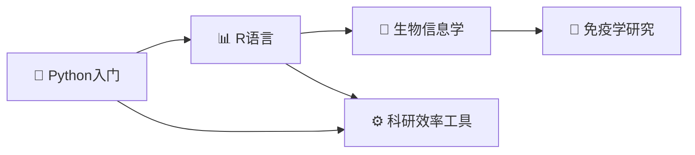

# 🧬 医学僧编程之旅

> 一个零基础医学生的编程学习之路  
> Python → R → 生物信息学 → 助力免疫学研究

---

## 👋 欢迎！

你好！这里是**属于我自己的编程学习网站**。

我是 YizL，一个医学生，零基础开始学编程。  
这个网站记录了我从 Python 入门，到 R 语言，再到生物信息学的**完整学习旅程**。

---

## 🗺️ 学习路线

| 阶段 | 内容 | 目标 |
|------|------|------|
| 🐍 **Python** | 语法基础 → 数据处理 → 自动化 | 建立编程思维，写第一个科研脚本 |
| 📊 **R语言** | 统计 → 可视化 → 生物信息包 | 能分析免疫学数据，画发表级图表 |
| 🔬 **免疫学应用** | 单细胞、流式、组学 | 用编程辅助研究生阶段的科研 |
| ⚙️ **效率工具** | Git、命令行、自动化 | 让电脑成为科研的助力而非障碍 |

---

## 📚 当前进度

- [ ] Python 学习路径 — 准备开始
- [ ] R 语言学习路径 — 待开始
- [ ] 任务管理系统搭建 — 待开始

---

## 🎯 为什么做这个网站

1. **记录学习轨迹** — 每一步都留下痕迹
2. **构建知识体系** — 把零散的知识组织成系统
3. **学以致用** — 每个知识点都和免疫学/科研挂钩
4. **见证成长** — 从第一行代码到完整的生物信息学分析

---

> 🚀 **千里之行，始于足下**  
> 今天开始写第一行代码！
